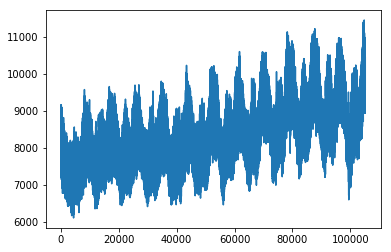
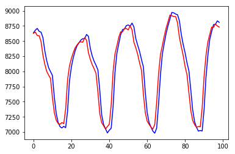

# LSTM电量负载预测

主要使用TensorFlow构建了LSTM模型实现了电量负载预测（单变量时间预测）。

原始数据的折线图：



训练过程：
```
setp: 0      train loss: 7.9421210289001465      validation loss: 7.800604730844498
best_loss: inf -> 7.800604730844498, save model.
setp: 500      train loss: 0.004870368167757988      validation loss: 0.3511730349389836
best_loss: 7.800604730844498 -> 0.3511730349389836, save model.
setp: 1000      train loss: 0.004037308506667614      validation loss: 0.07431437058839947
best_loss: 0.3511730349389836 -> 0.07431437058839947, save model.
setp: 1500      train loss: 0.002303384244441986      validation loss: 0.055476910434663296
best_loss: 0.07431437058839947 -> 0.055476910434663296, save model.
setp: 2000      train loss: 0.001969343051314354      validation loss: 0.05432232823222875
best_loss: 0.055476910434663296 -> 0.05432232823222875, save model.
setp: 2500      train loss: 0.0013308876659721136      validation loss: 0.054471371392719445
setp: 3000      train loss: 0.0007912603323347867      validation loss: 0.04746811070945114
best_loss: 0.05432232823222875 -> 0.04746811070945114, save model.
setp: 3500      train loss: 0.0006152402493171394      validation loss: 0.047773530287668106
setp: 4000      train loss: 0.00035344838397577405      validation loss: 0.04957545504439622
setp: 4500      train loss: 0.0006493263645097613      validation loss: 0.04814686665777117
setp: 5000      train loss: 0.0002610427909530699      validation loss: 0.04512298428453505
best_loss: 0.04746811070945114 -> 0.04512298428453505, save model.
setp: 5500      train loss: 0.0004519816138781607      validation loss: 0.046056712488643826
setp: 6000      train loss: 0.00023932449403218925      validation loss: 0.04570641254540533
setp: 6500      train loss: 0.00014523147547151893      validation loss: 0.0453616946702823
setp: 7000      train loss: 0.00011952155909966677      validation loss: 0.04618830240797252
setp: 7500      train loss: 0.0006494203116744757      validation loss: 0.04371175009291619
best_loss: 0.04512298428453505 -> 0.04371175009291619, save model.
setp: 8000      train loss: 0.0001230952184414491      validation loss: 0.04550474444404244
setp: 8500      train loss: 0.00010346870112698525      validation loss: 0.045836743572726844
setp: 9000      train loss: 0.00016646142466925085      validation loss: 0.045050444058142604
setp: 9500      train loss: 8.016314677661285e-05      validation loss: 0.04673052036669105
```

训练完模型后，取100个条数据做图：



